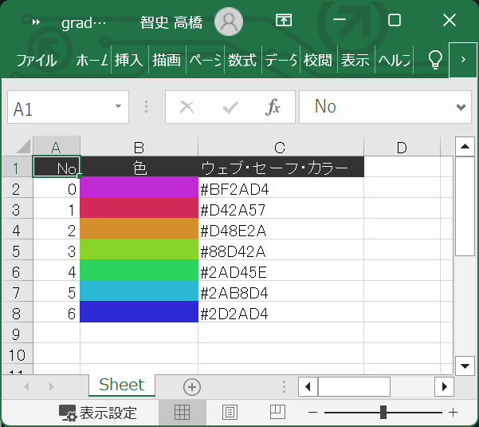
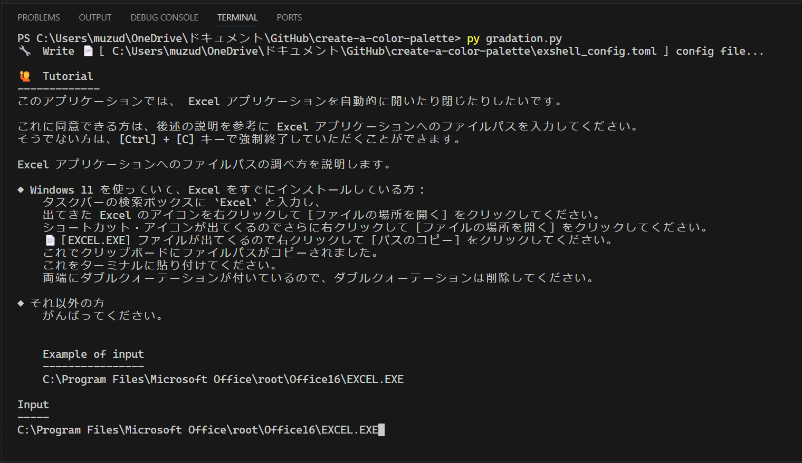
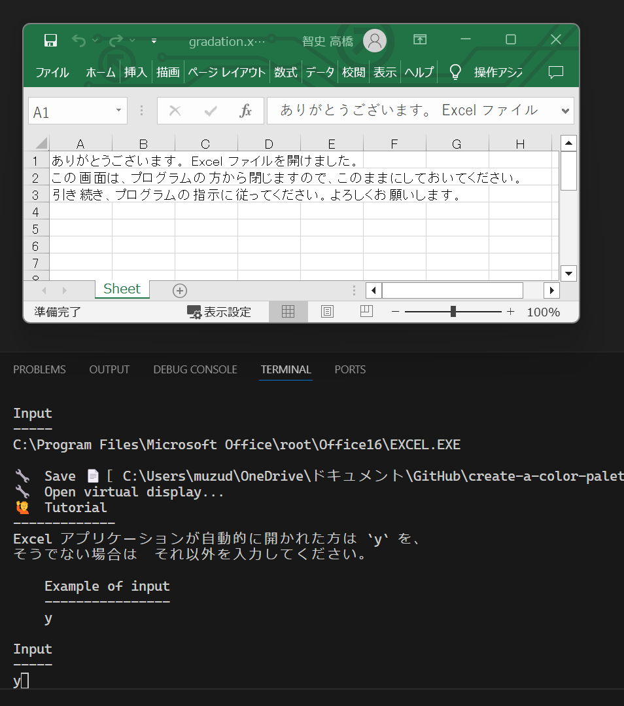
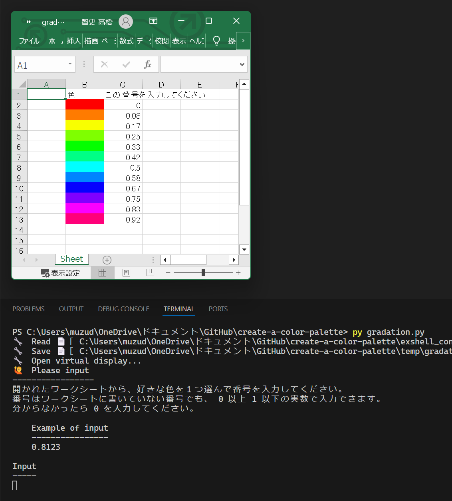

# create-a-color-palette

色パレットを作る


## 事前設定

* 構成
    * Windows 11 で動作確認しました
    * デスクトップ・アプリ版の Microsoft Excel がインストールされていることが必要です
* 手順
    * [インストールの手順](./docs/how_to_install.py)


## 例１

### 概要

  

👆　上図のような表を作成するアプリケーションです。  


### 実行手順

以下のコマンドを打鍵してください。  

```shell
py gradation.py
```

  

👆　上図。　EXCEL.exe ファイルへのパスを入力してください。  

  

👆　このアプリケーションが、 Excel を自動的に開けるようになりました。  

以下、自動的に Excel を開いたり閉じたりが行われます。（下図）  

  

ターミナルを見たり、 Excel を見たりしてください。  
